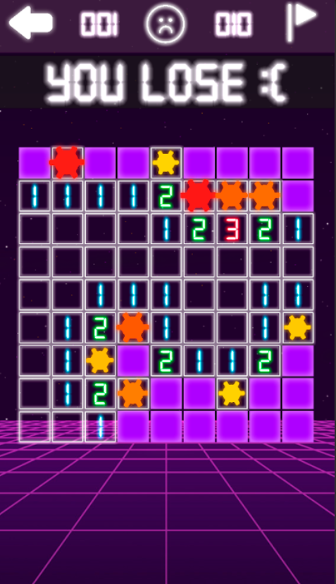

# Неоновый сапер
## Что это такое
Неоновый сапер - классический сапер на платформу Android с системой рекордов в крутом неоновом стиле. Игра написана на Unity в качестве челенджа за 5 дней. 
### Примеры

### Ключевые особенности
* 3 типа сложности
* Система рекордов
* Удобное управление
* Красивый неоновый стиль

## Ссылки
Автор - ekostenkodev@gmail.com

[Неоновый сапер в ПлейМаркете](https://play.google.com/store/apps/details?id=com.EKostenkoDev.NeonMine)
